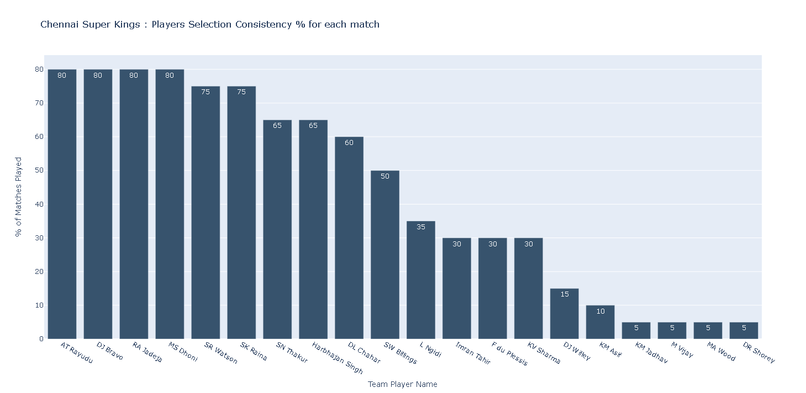
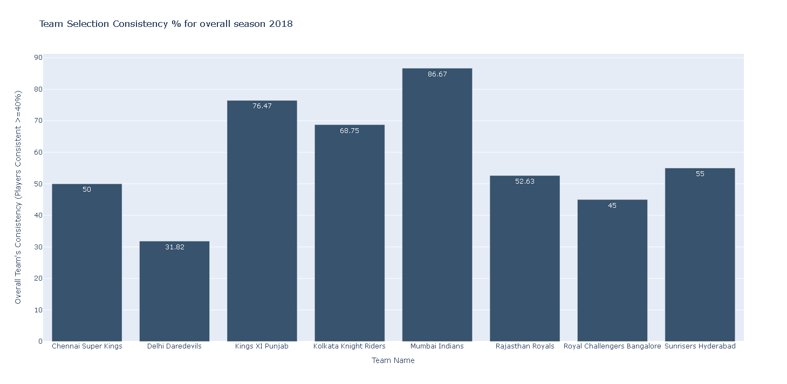
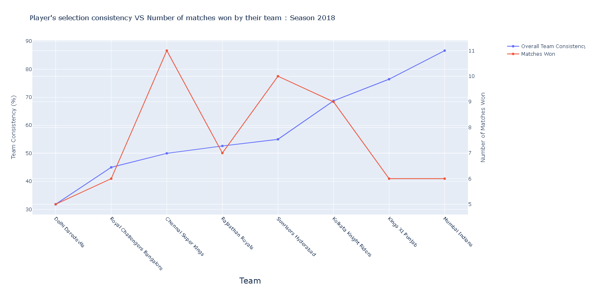
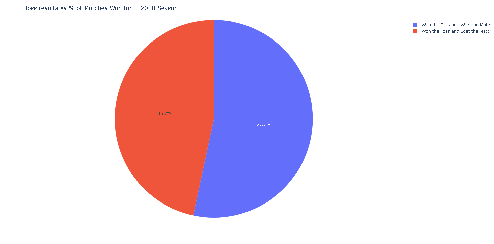
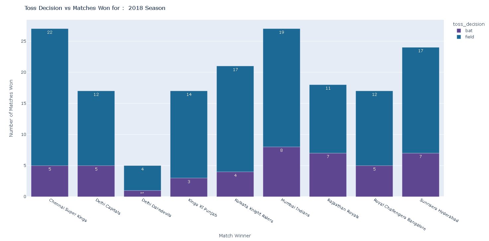

# 2022Fall_projects (Combination of Type I and Type III)

### Authors

* Venkatasubramanian Narasimman
* Burzin Wadia
* Arjun Kumaran

## Topic: Cricket Analytics – Evaluating strategies and captaincy in Twenty20 cricket (IPL)

Cricket is a bat-and-ball sport played between two teams of 11 players each on a 22-yard-long 
rectangular pitch. The team which scores the most runs in the stipulated balls (120 balls per 
side in case of Twenty20 cricket) is considered to win the game. But scoring runs is not as 
simple as it may seem and there is a lot of strategy that goes into the game. We look at 
strategy as decision-making and when it comes to decision-making, it is all in the hands of the 
captain of the team. Right from choosing the team, taking a call at the toss, usage of batters 
and bowlers, the captain makes most of the influential calls in the game. This makes us 
wonder if a captain can influence the game irrespective of the skill of the player just by making
the right calls. In this project we go about analyzing the success of teams in the Indian Premier 
League in the years 2018-2021 and the strategies incorporated by successful and unsuccessful 
teams.

With our present knowledge about T20 cricket, we come up with certain hypothesis and see 
if they actually hold true in the context of the game and if they have contributed to the success 
of the teams.

## Strategies and Hypothesis considered for assessing captaincy 

#### Limited Overs (T20)

### Hypothesis1 : Teams exploiting the power play (overs 1-6) tend to win games.
There are three phasesto a game of Twenty20 namely the powerplay, the middle 
overs and the death overs. It is believed that the teams which exploit the 
powerplay (the first 6 overs where fielding restrictions are imposed) tend to get 
the upper-hand in the game. However, teams have different approaches to 
different phases, and we are interested to analyze which phase do successful
teams target and maximize output in order to produce better results.

(Detailed explanation in the notebook)

### Hypothesis2 : Teams which adhere to pitch conditions increase their chances of winning.
Cricket is a game which is hugely affected by the pitch condition (i.e. the soil on 
which the game is being played on). Different approaches work in different 
conditions. We analyze what kind of strategies have been incorporated 
throughout the season in general in particular venues and whether or not the 
successful teams have gone to follow the pattern. Every decision on the field is 
completely taken by the captain of the team and we will analyze the strategies 
incorporated by successful teams.

### Hypothesis3 : Consistency in selection improves chances of winning the match.
A common conception is that playing the same set of players over a season will 
improve role clarity which will produce better output when compared to 
chopping and changing of players. On the other hand, there is a narrative of 
horses of courses also improves the chances of winning. We will analyze the 
selection process of successful teams, the roles assigned to players and if 
successful teams tweaked their side based on oppositions or conditions. Choosing 
the playing XI is completely in the hands of the captain.

Step 1 : Understanding Player’s consistency in the team

Step 2 : How consistent each team were while selecting players for each match ? ( 60%, 6 players )

Step 3 : Plot the overall team consistency vs Number of Matches Won by the team

 

Conclusion:

It is very evident from both the visualizations from the year 2018, it is not correct to say that
Consistency in selection improves chances of winning the match. Hence, Hypothesis 3 is not true.

### Hypothesis4 : Toss decision directly contributes to the result of the game.
Toss is one of the major decisions that a captain makes during the start of the 
game. A team either chooses to set a target or chase a target. We will analyze if 
there are any trends in making a particular decision at the toss and how beneficial
this decision can be in terms of deciding the outcome of the game.
An advanced ball by ball data set of the Indian Premier League from 2018-2021 is being used for 
the analysis and this cannot be found on the internet. This was scraped from the BCCI website a 
while ago which has now been blocked. Another info dataset about player selection and toss 
decisions is being obtained from Cricsheet.org website which is an open-source cricket data site.

The below pie chart helps us understand that there is a higher chance of a team winning when they tend to win the toss
initially. Although, toss decision plays a larger role here which is illustrated in the next chart.

The below image shows a Bar Graph of Toss Decision vs Matches Won for the year of 2018. It is very evident that teams
who won the toss and decided to field first had more winning to losing ratio.

Conclusion:

It is very evident from both the visualizations from the year 2018, that Toss decision directly contributes to the 
result of the game. Hence, Hypothesis 4 is true.

# ---------------------------------------------------------------------------------------------
URL1: https://github.com/Venkat3103/2022Fall_projects/blob/main/ipl_advanced_bbb_since_2018.csv

Our primary objective of this project is to consider various parameters in the game of cricket that 
are directly influenced by the decision of the team’s captain. We will thus be analyzing the impact 
of various decisions from various matches made by various

